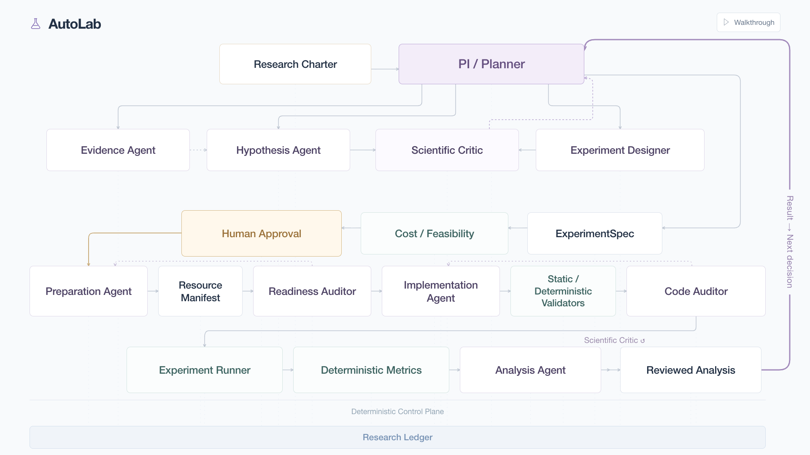
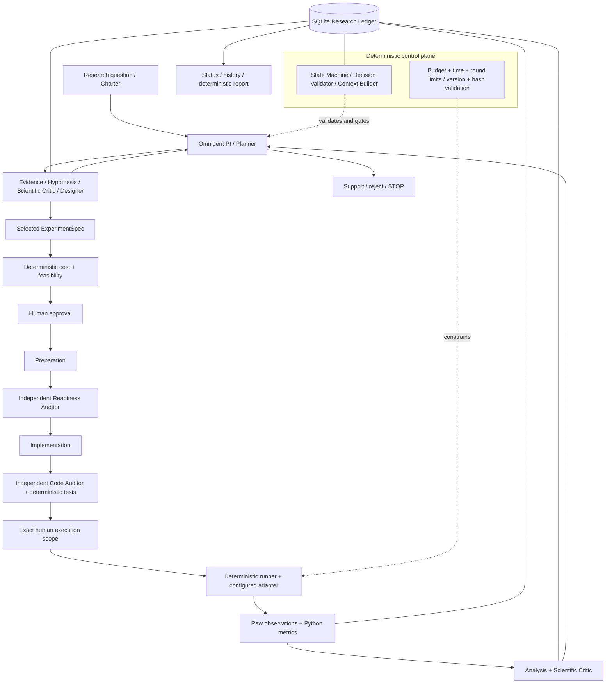

# AutoLab

**AutoLab is an Omnigent-powered adaptive multi-agent lab for computational AI research, with a persistent research ledger and explicit human approval.**

Give it a research question and an explicit scientific objective. Specialists gather evidence, propose and critique hypotheses, design experiments, prepare and audit resources, implement and audit code, and interpret computed results. The reviewed result returns to the PI / Planner, which decides what to investigate next.

**Question → Evidence → Hypothesis → Experiment → Result → Reviewed Analysis → Next Scientific Decision ↺**

[](docs/images/autolab-workflow.png)

**Current demo checkpoint:** the recorded live integration stopped at resource readiness after a rejected repair. It has no implementation, executed experiment or measured result. The downstream services exist and have offline test coverage; the final live end-to-end demo remains incomplete. See the [final audit](docs/FINAL_AUDIT.md).

## What Makes AutoLab’s Approach Different?

AutoLab pursues a larger research objective through small, reviewed steps. The Planner chooses the next useful action from the evidence and remaining uncertainty, with specialist agents responsible for proposing, challenging and carrying out the work.

- **Competing hypotheses before commitment.** The Hypothesis Agent proposes alternatives; the Scientific Critic reviews their scientific validity, and the Planner selects a reviewed hypothesis to investigate. Our live planning demo generated three hypotheses, reviewed two experiment candidates and selected one design. Rejected alternatives remain in the research history.
- **Small experiments that guide the next decision.** The Planner favors the smallest informative test. After reviewed results, it can gather more evidence, refine a hypothesis, request a follow-up or stop. This approach aims to reduce wasted work before committing to a larger experiment; negative and inconclusive findings still inform the next step.
- **Separate creators and evaluators.** The Scientific Critic reviews hypotheses, experiment designs and result interpretations. A Readiness Auditor checks prepared resources, while a Code Auditor checks implementation fidelity. Preparation and implementation agents cannot approve their own work.
- **Software-enforced checks alongside model review.** Python validates workflow transitions, checks execution prerequisites and computes canonical metrics from raw observations. A model's PASS verdict cannot override failed deterministic checks; reviewer agreement alone does not establish scientific truth.
- **Traceable, controlled research.** A persistent SQLite ledger retains sources, decisions, reviews and results. Versioned experiment contracts fix controls and metrics before execution, while resource/code hashes tie artifacts to their reviews. Human approval applies to an exact experiment version and action scope, with time and research-round limits bounding the workflow.

## Quick Start

### Prerequisites

- Python **3.12+**, `uv` and Git.
- An `OPENAI_API_KEY` with access to the configured `gpt-6.1-sol` model for live reasoning.
- Network access for model calls and OpenAlex/arXiv literature retrieval.

Installation pins **Omnigent 0.16.0** with its `agents-sdk` extra. Status, reports and normal tests work offline; no Node runtime is required.

### 1. Clone and enter the project

```bash
git clone https://github.com/Zyno-blank-new/autolab.git
cd autolab
```

Run the following commands from the directory containing `pyproject.toml`.

### 2. Create the environment

```bash
uv venv --python 3.12
source .venv/bin/activate
uv pip install -e '.[test]'
```

This installs AutoLab, its pinned runtime dependencies and pytest in an editable environment.

### 3. Configure the environment

```bash
cp .env.example .env
```

Set **`OPENAI_API_KEY`** privately in `.env` before live reasoning. It is the only variable in the example configuration. Keep credentials out of scientific records and version control.

Optional: `AUTOLAB_LEDGER_PATH` changes the default used by supporting services; the main CLI always requires an explicit `--db`. AutoLab configures local Omnigent state in ignored `.omnigent/` and disables tracing/telemetry by default.

### 4. Verify AutoLab

```bash
autolab --help
python -m autolab.planner_smoke --check
```

The second command checks imports, Planner YAML and structured-output parsing without calling a model. It does not verify provider connectivity.

## Try AutoLab

The preferred interactive entry point is:

```bash
autolab research "When does clipping scalar predictions to [0,1] help or harm accuracy?"
```

AutoLab asks for your objective, primary outcome and success criterion, displays the charter, and waits for you to type `START`. It then creates a fresh project and invokes the real Planner and its selected legal specialist work. The default invocation is bounded to one Planner step, a $2 allocation and a 15-minute window; the charter permits up to six research rounds and one experiment. These are research limits, not a provider billing cap or experiment approval.

Persisted events appear while work runs, and AutoLab prints the exact ledger/project commands for status, continuation, history and reports. Use `--create-only` to save the confirmed charter without model calls, or `--max-steps` to choose 1–20 Planner steps. Existing projects use `continue`; `research` requires a new ledger. Experiment approval, readiness and execution gates still apply.

### Explicit multi-command workflow

For control over the charter and ledger path, start a fresh ledger explicitly:

```bash
autolab start --db research_state/my-study.db \
  --question "When does clipping scalar predictions to [0,1] help or harm accuracy?" \
  --objective "Compare unchanged and clipped predictions on frozen synthetic cohorts" \
  --primary-outcome "Difference in mean absolute error between conditions" \
  --success-criterion "A reviewed comparison scoped to the preregistered cohorts" \
  --budget-usd 5 --time-minutes 30 --max-rounds 6
```

`start` validates and persists the charter; it makes no model call. It prints the new project ID. Use that ID below; a new empty ledger normally starts at `PROJECT_0001`:

```bash
PROJECT_ID=PROJECT_0001
autolab status --db research_state/my-study.db --project "$PROJECT_ID"
autolab continue --db research_state/my-study.db --project "$PROJECT_ID" --max-steps 4
```

`continue` may make paid Omnigent calls. It asks the Planner for legal next actions, dispatches specialists and persists their outputs. It returns at the step limit, a human gate, a block, pause, STOP or a reconciliation boundary. Inspect status before continuing again; a completed stage does not automatically launch another experiment.

**What to expect:** evidence retrieval, reviewed hypotheses, reviewed candidate designs and Planner selection can proceed through the CLI. At selection, use the separate feasibility/approval module below to produce a current approval packet. Preparation and implementation remain gated; implementation tests and execution require operator-configured adapters and exact execution authorization. The ordinary CLI is not a turnkey end-to-end runner for arbitrary questions.

The allocation and time limit are research constraints, not a provider billing meter. Unknown costs remain unknown. Omitted intake limits default to zero spending allocation, unconfigured elapsed time and one research round; this example supplies them explicitly. Evidence/hypothesis actions also contribute to round history, so rounds are not simply experiment counts. A canonical charter JSON can alternatively be supplied with `autolab start --db research_state/my-study.db --charter charter.json`; do not combine it with intake fields.

At any checkpoint, produce a report:

```bash
autolab report --db research_state/my-study.db --project "$PROJECT_ID"
```

It prints the report path, including for an incomplete or blocked investigation.

## Human Approval

AutoLab pauses before consequential preparation, implementation or execution. The Planner cannot grant human approval, and approval cannot override failed scientific or readiness checks.

After status identifies a selected, PASS-reviewed ExperimentSpec, replace `EXP_ID` and `SPEC_VERSION` with its actual ID and version:

```bash
EXP_ID=EXP_0001
SPEC_VERSION=1
python -m autolab.approval --db research_state/my-study.db assess \
  --project "$PROJECT_ID" --experiment "$EXP_ID" --version "$SPEC_VERSION"
python -m autolab.approval --db research_state/my-study.db show \
  --project "$PROJECT_ID" --experiment "$EXP_ID" --version "$SPEC_VERSION"
```

`assess` checks declared capabilities, costs, runtime and resource access, then persists an approval packet; it does not acquire resources or run code. The default assessment is conservative and may require user input. Operators can supply `assess --config feasibility.json`, a public JSON object containing `capabilities` and `inputs`, matching the selected spec and the [feasibility schemas](src/autolab/feasibility/models.py). Resolve unknown access and blockers before approving; an availability declaration is not a readiness audit.

Set `PACKET_ID` to the actual `APKT` ID printed by the packet or status. Choose **one** response:

```bash
PACKET_ID=APKT_0001
autolab approve --db research_state/my-study.db --project "$PROJECT_ID" --packet "$PACKET_ID"
autolab reject --db research_state/my-study.db --project "$PROJECT_ID" --packet "$PACKET_ID" --note "Reconsider the design"
autolab modify --db research_state/my-study.db --project "$PROJECT_ID" --packet "$PACKET_ID" --note "Request a smaller cohort"
```

`approve` displays the packet and asks you to type `APPROVE <packet ID>`. `--yes` is an explicit non-interactive human confirmation. Unknown estimates additionally require `--acknowledge-unknowns`, `--max-cost-usd` and `--max-runtime-minutes` with chosen caps. `modify` records a request; it does not edit the contract.

Approval is bound to the exact ExperimentSpec version and current assessment. A changed spec or stale assessment requires a fresh packet and approval. Default approval permits **preparation only**; `--include-implementation` also permits implementation. **Neither grants RUN permission.** Execution requires a separate exact audited implementation scope and an operator-supplied runtime adapter; there is currently no ordinary CLI command that grants that scope. Continue only within the approved scope using the command above.

## Check Research Status

```bash
autolab status --db research_state/my-study.db --project "$PROJECT_ID"
autolab status --db research_state/my-study.db --project "$PROJECT_ID" --json
autolab history --db research_state/my-study.db --project "$PROJECT_ID"
```

Status exposes the current state, selected hypothesis and experiment, latest run/analysis, Planner decision, blockers, approval packet/human action, known spend, estimates, unknown costs, elapsed time and research rounds. History shows chronological scientific milestones. Both read the selected ledger/project without model calls.

## Pause and Resume

```bash
autolab pause --db research_state/my-study.db --project "$PROJECT_ID" --note "Review the current evidence"
autolab resume --db research_state/my-study.db --project "$PROJECT_ID"
autolab stop --db research_state/my-study.db --project "$PROJECT_ID" --note "End this investigation"
```

Pause preserves science, approvals, budgets and history and prevents new continuation; it does not kill an already running worker. Resume applies only to a paused project and does not reset limits or bypass blockers. Human or Planner STOP is terminal. Interrupted dispatches require explicit reconciliation rather than a blind repeat.

## What AutoLab Does

These are the scientific dependencies of an admitted experiment, not a mandatory sequence for every question:

1. **Research Charter:** records the explicit question, objective, outcomes, criteria and limits.
2. **PI / Planner:** chooses the next scientifically useful action from current state.
3. **Evidence Agent:** retrieves publication records and extracts claims with source provenance.
4. **Hypothesis Agent:** proposes falsifiable hypotheses grounded in available evidence.
5. **Scientific Critic:** challenges hypotheses and requests revision when necessary.
6. **Experiment Designer:** proposes candidate protocols for independent critique and Planner selection into an ExperimentSpec.
7. **Cost / Feasibility:** deterministic utilities assess requirements, estimates and unresolved access.
8. **Human Approval:** records a decision for the exact packet, contract version and permitted scope.
9. **Preparation Agent:** prepares and registers resources within the approved contract.
10. **Readiness Auditor:** independently evaluates resource, technical, scientific and quality readiness.
11. **Implementation Agent:** generates code faithful to the admitted experiment contract.
12. **Code Auditor:** independently reviews the implementation alongside deterministic tests.
13. **Deterministic Experiment Runner:** executes only an admitted, authorized implementation through configured adapters.
14. **Deterministic Metrics:** computes canonical measurements from raw observations in Python.
15. **Analysis Agent:** interprets measurements against preregistered criteria and states limitations.
16. **Scientific Critic:** independently reviews the analysis and scientific claims.
17. **Planner receives the result:** selects the next action using the reviewed result and remaining constraints.

## The Adaptive Loop

After a reviewed result, the Planner can gather more evidence, refine a hypothesis, design a follow-up, accept sufficient support for the charter decision, reject a hypothesis or stop. Acceptance is scoped scientific support, never proof.

AutoLab does not run another experiment merely because the previous one finished. The Planner chooses the next useful action; the deterministic control plane decides whether it is legal. Follow-ups need a fresh reviewed contract, feasibility assessment and exact approval. Negative and inconclusive results remain part of the decision history.

## Architecture



The Planner decides **what** is scientifically valuable; the control plane decides **whether** an action is legal; specialists decide **how** to perform their task. Artifacts and decisions persist in the ledger and return as scoped context rather than unrestricted agent conversation.

## Omnigent's Role

Omnigent **0.16.0** invokes the specialist reasoning roles through its local server and `openai-agents` harness. AutoLab validates the Planner's route, dispatches the selected service and persists structured handoffs.

The actual policy in [`agents/`](agents/) is **GPT-6.1 Sol (`gpt-6.1-sol`)** for all ten roles:

| Reasoning effort | Roles |
| --- | --- |
| High | PI / Planner, Hypothesis Agent, Scientific Critic, Experiment Designer, Preparation Agent, Readiness Auditor, Implementation Agent, Code Auditor, Analysis Agent |
| Medium | Evidence Agent |

There is no silent model fallback. The State Machine, Decision Validator, Context Builder, Research Ledger, cost/resource/code validators, Experiment Runner, metric computation and report renderer are **deterministic software, not Omnigent reasoning agents**.

## Scientific Safeguards

- **Preregistered contract:** ExperimentSpec fixes conditions, controls, data requirements, metrics and interpretation criteria before execution; amendments are explicit versions.
- **Human control:** consequential actions require exact-version approval within a permitted action and cost/time scope.
- **Independent readiness:** the Preparation Agent cannot approve its own resources.
- **Independent code audit:** the Implementation Agent cannot approve its own code; deterministic test failures block admission.
- **Deterministic execution:** Python workers run experiments and compute canonical metrics; original artifacts support independent recomputation.
- **Provenance:** publication links, scientific versions, resource/code hashes, raw observations and run-scoped metrics stay traceable.
- **Bounded autonomy:** budget/time checks, research limits and bounded reviews/repairs constrain work; unknown provider billing remains explicit.
- **Persistent memory:** SQLite is the source of truth; LLM context is not permanent research memory.

## Example Workflow

**Illustrative workflow, not captured terminal output or a measured result:**

```text
[Planner] chooses GATHER_EVIDENCE
[Evidence Agent] persists source-linked evidence
[Hypothesis Agent + Scientific Critic] propose, review and refine hypotheses
[Designer + Scientific Critic] review candidate experiments
[Planner] selects an exact ExperimentSpec
[Feasibility / Human] inspect requirements and record scoped approval
[Preparation / Readiness] prepare resources; PASS, REPAIR or BLOCK
[Implementation / Code Auditor] generate code; audit and test it
[Human / configured runtime] authorize exact execution scope
[Runner / Metrics] capture raw observations and compute measurements
[Analysis / Scientific Critic] review interpretation and uncertainty
[Planner] choose evidence, refinement, follow-up, disposition or STOP
```

Any failed prerequisite may halt this flow. The recorded final demo reached readiness and a rejected repair, not the downstream run/analysis stages.

## Generate the Research Report

`autolab report` regenerates a living Markdown report deterministically from the selected Research Ledger. It includes the charter, evidence/provenance and references, hypotheses, candidate/selected designs, human decisions, preparation/readiness, implementations and audits, runs/metrics, reviewed analyses, adaptive choices, limitations and process telemetry—where records exist.

Default output:

```text
reports/<project_id>/<ledger-path-digest>/research_report.md
```

The ledger digest separates reports for different databases using the same project ID. `report --json` emits a structured generation receipt; `--reports-dir` changes the report root. Reports never infer measurements for unexecuted work and are not generated from model memory. Missing stages and unknown timings stay visible.

## What Gets Persisted?

The SQLite Research Ledger stores charters, sources, evidence, hypotheses, reviews, experiment candidates/specifications, costs, resources/readiness, implementations, runs, metrics, analyses, Planner decisions and events. Human approvals and action scopes are recorded in events; manifests and larger code/result artifacts live in files referenced by ledger records.

Scientifically important dependencies are versioned and hash-pinned. Historical branches, rejected proposals and contradictory evidence remain available. Use explicit `--db` and `--project` to inspect the intended investigation; the CLI does not discover fixtures automatically.

## Demo

For a short hackathon walkthrough, follow [`docs/DEMO_SCRIPT.md`](docs/DEMO_SCRIPT.md). Its main path inspects a **persisted incomplete checkpoint offline**. On a fresh clone, generated demo databases may be unavailable; [`docs/DEMO_REPORT.md`](docs/DEMO_REPORT.md) is the portable earlier checkpoint. It contains no observed final-demo experiment metrics. A completed live fallback is not available.

Developers can request a fresh isolated live integration:

```bash
python -m autolab.final_e2e_integration_smoke --stop-at-approval
```

Omitting `--db` creates a fresh charter-only demo namespace. This command makes real model/provider calls, supplies demo-specific operators/adapters and stops at approval. It may also stop or fail earlier. It is an integration check, not general arbitrary-topic execution. Automated test-human execution is a separate explicit test option; see the demo script for its scope and limits. Do not present stored checkpoints as a live completed run.

## Scientific Output vs Workflow Status

A **COMPLETED** experiment run means execution completed, not that the hypothesis is supported. Scientific analysis can be **SUPPORTED**, **NOT_SUPPORTED** or **INCONCLUSIVE**. An experiment can be **BLOCKED** before execution when its prerequisites are unresolved. These outcomes preserve the scientific distinction between executing a protocol and learning something supported by its results.

## Current Scope and Limitations

AutoLab targets computational AI research, including questions about prompting, retrieval, embeddings, agent reliability, model comparison, robustness, synthetic-data evaluation and inference. These are research domains, not a promise of built-in runtime adapters for every task. Current execution focuses on small, operator-adapted offline protocols. Physical and wet-lab execution are unsupported.

- External model/literature providers affect availability, latency and live outcomes.
- Semantic reviews remain model-based; schema checks and reviewer agreement do not establish scientific truth.
- Restricted Python workers provide defense in depth, not a complete OS sandbox or guaranteed reproducibility of external model responses.
- Experimental validity and statistical claims depend on preregistered design, data quality and sample adequacy; four constructed demo rows establish neither population efficacy nor significance.
- Unknown costs remain UNKNOWN; charter allocations do not measure or enforce provider billing by themselves.
- Unsupported resources/capabilities block execution. The current final demo has unresolved readiness findings and a rejected repair; no final live execution/result is certified.

## Why This Is Not Just Another Multi-Agent Workflow

Agents create persistent scientific artifacts—EvidenceRecords, Hypotheses, ExperimentSpecs, resource manifests, ImplementationRecords, ExperimentRuns, MetricRecords, ScientificAnalyses and NextDecisions—alongside exact approval events. Deterministic gates independently validate transitions. Reviewed results return to the Planner and can change the next scientific action, including ending the investigation.

## Research Integrity

Publication claims require retrieved source provenance; references come from SourceRecords. Canonical metrics are computed in Python, human approval is explicit, and scientific contracts cannot silently change. Version/hash validation protects dependencies. Negative, inconclusive and contradictory findings are retained rather than replaced with a favorable narrative. No hypothesis proof or unmeasured speed multiplier is claimed.

## Project Structure

```text
autolab/
├── agents/                      # Omnigent role definitions
├── src/autolab/
│   ├── cli.py, interface.py      # Intake and human controls
│   ├── orchestration/, planner/ # Adaptive control and PI reasoning
│   ├── literature/, hypotheses/, experiment_design/
│   ├── feasibility/, preparation/, readiness/
│   ├── implementation/, runtime/, analysis/
│   └── ledger/, reporting/      # Persistent state and outputs
├── experiments/                 # Generated resources and code
├── research_state/              # SQLite ledgers
├── reports/, results/           # Generated reports and receipts
├── docs/, tools/
└── tests/
```

## Development / Tests

```bash
python -m pytest -q
```

The full offline suite currently passes **1,061 tests**. Normal tests do not make paid model/provider calls. Explicit live integration checks can do so; their outcomes are separate from offline regression coverage.

### Useful Integration Checks

```bash
python -m autolab.cli_integration_smoke
python -m autolab.planner_smoke
python -m autolab.final_e2e_integration_smoke --help
```

The CLI smoke creates isolated state and checks intake/status/pause/resume without providers. The Planner smoke makes one real model call to check connectivity and parsing; it is not a complete research loop. The final command shows available integration controls without running them. Generated smoke artifacts are ignored by Git.

## Documentation

- [Architecture](docs/ARCHITECTURE.md) — component boundaries and scientific contracts.
- [Master plan](docs/MASTER_PLAN.md) — product specification and development history.
- [Demo script](docs/DEMO_SCRIPT.md) — honest checkpoint walkthrough and live test scope.
- [Submission summary](docs/SUBMISSION.md) — challenge alignment and current evidence.
- [Acceleration evidence](docs/ACCELERATION_EVIDENCE.md) — recorded timings/counts and measurement limits.
- [Final audit](docs/FINAL_AUDIT.md) — incomplete integration findings and remaining work.

The plan and architecture documents retain historical intended-behavior notes; this README's commands and model policy follow the current code and agent configuration.
