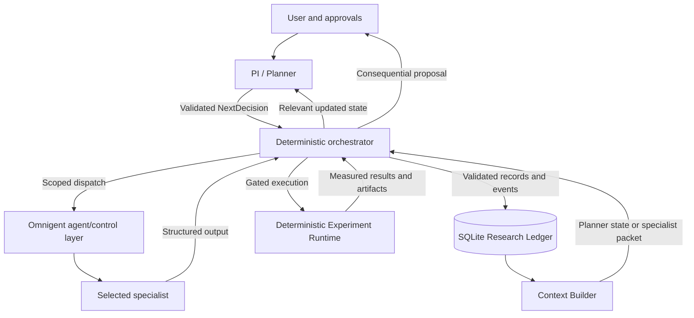

# AutoLab Architecture

Authoritative technical boundaries for the computational AI research system described in [MASTER_PLAN.md](MASTER_PLAN.md). Read both documents before implementation. Architectural changes require explicit human approval; implementation may flag conflicts for resolution. This document specifies intended behavior and does not certify that future components already exist.

## Architectural Principles

**Strong models reason. Deterministic code verifies and executes. Omnigent orchestrates. SQLite preserves research memory. Humans approve consequential or expensive actions.**

AutoLab is generalized within computational AI research. The hackathon implements one vertical discovery slice before broadening domains or infrastructure. Unsupported capabilities are explicit blockers or future work.

## Component Boundaries

| Component | Owns | Does not own |
| --- | --- | --- |
| PI / Planner agent | Next scientific action, goal alignment, candidate selection, scientific stopping decision | Literature extraction, implementation, or all specialist tasks |
| Scientific Critic | Challenges hypotheses, designs, analyses, and conclusions; reports scientific issues | Final selection or permission to bypass a gate |
| Literature / Evidence agent | Retrieval and grounded claim extraction | Invented references or measurements |
| Hypothesis agent | Approximately three competing falsifiable proposals | Unreviewed selection or goal changes |
| Experiment Designer | Candidate designs and the scientific ExperimentSpec | Code implementation or post-result metric changes |
| Preparation agent | Resource creation, transformation, resolution, and registration | Independent approval of its own resources |
| Readiness Auditor | Four readiness gates, supported by deterministic and semantic checks | Resource generation or automatic acceptance of technical validity |
| Implementation agent | Faithful spec-to-code translation | Redesign of the scientific contract |
| Code Auditor | Independent spec fidelity, code correctness, and reproducibility review | Replacing deterministic tests with agreement |
| Experiment Runtime | Actual execution, artifact capture, and metric computation | LLM-invented results or scientific interpretation |
| Analysis agent | Interpretation, uncertainty, limitations, and follow-up recommendations | Rewriting raw observations or declaring statistical proof from labels |
| Deterministic orchestrator / Context Builder | Legal transitions, gates, validation, budget/time enforcement, context selection, persistence | Inventing scientific conclusions or unrestricted agent chat |
| Omnigent | Agent dispatch, tool/control integration, and specialist lifecycle coordination | A replacement for AutoLab's scientific record or domain contracts |
| Research Ledger | Persistent structured scientific state and audit history | Treating a chat transcript as canonical research memory |
| CLI / report interfaces | Intake, state visibility, approvals, pause/resume, and traceable outputs | Independent research-state storage |

Cost/feasibility estimation is a deterministic utility with Planner interpretation of uncertain estimates, not an extra mandatory agent. One Scientific Critic role serves all scientific review stages. The Readiness Auditor and Code Auditor are independent roles with different contracts; they need not introduce additional infrastructure.

## Agent Communication

Use centralized PI / Planner control. Specialists return structured records to the orchestrator, which validates and persists them. The Planner receives relevant state and selects a permitted next action. The Context Builder retrieves the necessary records, and Omnigent dispatches the selected specialist.

There is no unrestricted specialist-to-specialist conversation network. Review feedback and rebuttal are routed through the central control layer and recorded. The Planner may choose among legal actions; deterministic gates constrain what can actually execute.

The existing successful launch is `python -m autolab.launch run --harness openai-agents --model gpt-5.4 --server local`. Preserve it. Phase 3 must verify the installed Omnigent 0.16.0 integration against its [official repository documentation](https://github.com/omnigent-ai/omnigent), choosing supported APIs rather than inventing a new orchestration harness. Omnigent must visibly coordinate specialists; a sequential Python-only LLM workflow is insufficient.

## Data / Object Flow

| Producer / stage | Structured output | Primary consumer |
| --- | --- | --- |
| User intake | ResearchCharter | Planner and relevant specialists |
| Literature retrieval / extraction | SourceRecord, EvidenceRecord | Hypothesis agent, Scientific Critic, Planner |
| Hypothesis proposal | Hypothesis | Scientific Critic and Planner |
| Scientific or code review | ReviewRecord | Proposal author, Planner, gate enforcement |
| Experiment design | ExperimentCandidate, ExperimentSpec | Planner, feasibility checks, approver, preparation |
| Preparation | ResourceRecord, ResourceManifest | Readiness Auditor and Implementation agent |
| Independent readiness | ReadinessReport | Orchestrator and Planner |
| Implementation | ImplementationRecord, code artifacts | Code Auditor and runtime |
| Runtime | ExperimentRun, raw artifact references, MetricRecord | Analysis agent and Scientific Critic |
| Analysis | ScientificAnalysis | Scientific Critic and Planner |
| Planner | NextDecision | Orchestrator and Context Builder |
| Estimation / execution accounting | CostRecord | Budget enforcement, Planner, user |
| Meaningful transition or action | EventRecord | Audit history, status, reporting |

ResourceManifest and ContextPacket are intended future contracts. Raw-result artifact layout and BaseExperiment are also future runtime contracts. Existing models must be reconciled before adding definitions; this documentation task creates no new schemas.

A ContextPacket selects relevant IDs and versions instead of embedding the entire project history. For analysis, include the charter, selected hypothesis, contract, preregistered metrics, raw results, computed measurements, relevant evidence, and limitations. Context selection should preserve provenance while reducing cost, pollution, and reasoning contamination.

## Persistent State

SQLite is the source of truth at `research_state/autolab.db`, with configurable path override. Keep generated databases, journals, and secrets out of Git. No external database or separate frontend state backend is required.

Store projects, sources, evidence, hypotheses, reviews, experiment candidates, contracts, resources, readiness, implementations, runs, metrics, analyses, decisions, costs, and events. Generic ReviewRecord distinguishes review type and target. Use stable human-readable IDs and exact versions for scientific dependencies.

Persist validated outputs before downstream use. Record approvals, review/rebuttal, costs, errors, meaningful transitions, and decision rationale with contextual IDs. Audit order is chronological with a deterministic tie-breaker. Files contain large artifacts; ledger records reference paths, versions, checksums, and provenance.

The existing repository already contains Phase 2 schemas and ledger implementation from prior work. The MASTER_PLAN phase table deliberately uses the user's new NOT STARTED planning baseline for Phase 2 reconciliation against these documents. Preserve and inspect existing code; do not delete or blindly duplicate it. README's historical implementation status remains intact.

## Scientific Contracts

ResearchCharter fixes the question, objective, primary outcome, success criteria, constraints, budget, time limit, and stopping conditions. Significant goal changes require explicit human approval and a linked new charter/project; preserve the previous objective and decision trail.

Hypotheses include falsifiable predictions and supporting/contradicting evidence. Their scores are comparison aids. Hypothesis revisions preserve previous versions.

ExperimentSpec precedes implementation and specifies variables, controls, data/resource/capability requirements, metrics, success and falsification criteria, assumptions, confounds, estimates, and expected information gain. Changes create new versions with reasons and review. Post-result changes must be identified as exploratory or revised tests, not silently substituted into preregistration.

NextDecision includes an action, reason, goal alignment, expected information gain, target specialist, relevant context IDs, and remaining budget. It expresses the next choice, not a complete fixed plan. ACCEPT_HYPOTHESIS means tentative acceptance supported by available evidence, not proof.

Source and evidence links preserve `claim → EvidenceRecord → SourceRecord → original publication`. Publication assertions, derived interpretations, and locally observed measurements remain distinguishable.

## Validation Boundaries

1. **Intake:** validate structured charter and required constraints; clarify missing scientific requirements.
2. **Specialist outputs:** schema validation and ID/project/version checks before persistence or dispatch.
3. **Evidence:** verify source provenance, deduplication, support text, and claim location; missing data remains missing.
4. **Scientific selection:** critic review plus Planner rationale; pass scientific prerequisites before selecting execution.
5. **Cost / approval:** capability checks and an approved spending/runtime envelope before consequential work.
6. **Readiness:** independent resource, technical, scientific, and quality checks.
7. **Implementation:** independent code audit plus deterministic tests for spec fidelity, leakage, seeds, and failure handling.
8. **Execution:** deterministic artifact and metric capture, with visible errors.
9. **Analysis:** ground findings in raw results and preregistered metrics; scientific critique before a new decision or conclusion.

Readiness combines deterministic checks—file/schema validity, counts, duplicates, missing values, distributions, hashes, leakage, dimensions, and statistics—with semantic checks of suitability, labels, diversity, confounds, synthetic artifacts, and transformation fidelity. A technically usable resource can still be scientifically invalid and must be blockable.

Review verdicts are PASS, REVISE, REJECT, or BLOCK. Readiness verdicts are PASS, REPAIR, or BLOCK. Human decisions are APPROVE, MODIFY, or REJECT. Implementer issue responses are ACCEPT, REJECT, or NEEDS_CLARIFICATION. Keep these namespaces distinct.

## Experiment Runtime Contract

The conceptual `BaseExperiment` exposes:

- `setup()`: resolve approved resources and establish the recorded environment.
- `run()`: execute the selected implementation under recorded seed, controls, and limits.
- `collect_results()`: return raw artifacts and code-computed metrics with provenance.

Runtime is deterministic software, not an agent inventing measurements. Record start/completion times, seed, environment/model versions, manifests and hashes, stdout/stderr, raw outputs, metrics, errors, and measurable cost. External model responses may remain nondeterministic; record that limitation instead of promising identical reruns.

Selected experiments use isolated directories for spec, implementation plan, code, resource manifest, readiness and review reports, artifacts/logs, and results. Preserve per-run and per-version outputs. Shared large datasets are referenced rather than copied unnecessarily. The exact runtime/artifact interfaces are later-phase work.

## Decision / Review Loops

A proposal enters review; its author revises or rebuts issues; the critic/auditor reassesses. Bound scientific review and code review to at most two cycles per proposal/implementation version. Bound preparation repair to at most two cycles per ExperimentSpec version. Persist every cycle and unresolved issue.

When limits are exhausted, return to the Planner for another candidate, more evidence, human clarification, a block, or a stop. Do not endlessly repeat debate or treat a new superficial version as permission to evade the budget or review limit.

After a run, analysis and critique update the Planner's state. The Planner chooses the smallest informative next experiment or an earlier scientific action. Sequential experiments are preferred when later tests depend on earlier results. Parallel tests must be independent, cheap, safe, and within approval/budget constraints.

## Human Approval Boundaries

Require recorded approval before expensive or consequential execution and before significant research-goal changes. Present the contract/version, estimated model/API and compute costs, runtime, calls where estimable, data/storage requirements, feasibility risks, and information gain.

An approval applies to an explicit scope and spending/runtime envelope. MODIFY returns the proposal for revision; REJECT prevents execution of that proposal. Material changes or exceeding approved limits require new approval. Preparation downloads, generation, or dependency changes that are consequential or expensive are included in this boundary.

Approval cannot convert scientifically invalid resources or unvalidated code into a runnable experiment. Routine actions within an existing approved scope do not require repeated approval prompts.

## Failure Handling

| Failure | Intended response |
| --- | --- |
| Invalid structured output or broken reference | Reject persistence/dispatch, record the failure, and use bounded repair or return to Planner |
| Missing source provenance | Do not assert the citation-backed claim; retrieve/verify evidence or mark the gap |
| Unsupported capability / unavailable resource | Record the gap, choose a feasible alternative, block, or describe future work |
| Readiness REPAIR | Send specific checks back to preparation within the repair bound |
| Readiness BLOCK / exhausted repair | Return findings to Planner; do not run |
| Review rejection / blocking code issue | Revise or rebut within the bound; unresolved blocking issues prevent execution |
| Rejected or pending human approval | Do not execute the unapproved proposal |
| Budget/time limit reached | Stop new spending, preserve state, and request approved revision or stop |
| Runtime error | Preserve logs and partial artifacts; record failure without inventing metrics; Planner assesses a follow-up |
| Insufficient or conflicting evidence | Report uncertainty; gather evidence, redesign, or stop inconclusively |
| Process interruption / user pause | Preserve completed records and pending gates; resume from ledger state without silently rerunning consequential work |

Deterministic enforcement may halt execution immediately; the Planner decides the subsequent scientific action within available constraints. Scientific honesty outranks always producing a favorable result.

## Extensibility

Keep scientific contracts and orchestration domain-independent within computational AI research. Add evidence adapters and resource/runtime capabilities behind explicit contracts. OpenAlex and arXiv come first; other adapters are future work driven by need.

The reliability demo is an experiment specification, not a condition hard-coded into the Planner. A later frontend reads the same ledger after the loop works. Avoid physical science claims, a large agent swarm, unrestricted chats, distributed infrastructure, cloud databases, and memory frameworks without a demonstrated core-loop need.

## Non-Negotiable Rules

1. The Research Ledger is the persistent source of truth.
2. LLM context is not persistent research memory.
3. Agents communicate with structured objects where possible.
4. The central PI / Planner chooses the next scientific action.
5. Agents do not form unrestricted peer-to-peer conversational networks.
6. ResearchCharter defines the goal and cannot be silently changed.
7. ExperimentSpec is created before implementation.
8. Metrics and success criteria are established before results; later changes are explicit versions.
9. Preparation and readiness validation are separate responsibilities.
10. Implementation and code review are separate responsibilities.
11. Deterministic tests outrank agent confidence.
12. Experiment Runtime is deterministic code, not an LLM.
13. LLMs interpret results; they do not invent measurements.
14. Citations require real source provenance.
15. Every important scientific decision is traceable.
16. Review and repair loops are bounded.
17. Expensive or consequential actions require human approval.
18. The Planner operates under budget/time constraints.
19. Prefer the smallest informative experiment first.
20. Parallelize only independent experiments within safe, approved limits.
21. AutoLab may block an invalid experiment.
22. Scientific honesty is more important than always producing a result.
23. Build a vertical discovery loop before adding breadth.
