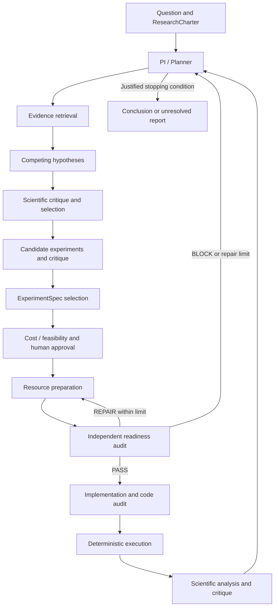
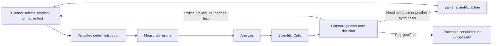

# AutoLab

Authoritative product and research specification for the Databricks Agentic Scientific Discovery / Hack-Nation project. Read this document and [ARCHITECTURE.md](ARCHITECTURE.md) before implementation.

**Governance:** Implementation may flag architectural conflicts, but architectural changes require explicit human approval. Future implementation tasks may update phase statuses after successful completion; they must not rewrite the architecture without that approval.

## 1. Vision

AutoLab is an Omnigent-powered adaptive multi-agent lab for computational AI research. A user supplies a research question, objective, constraints, and budget. A central PI / Planner selects the next scientific action as evidence and results arrive, coordinates specialists through Omnigent, and preserves the investigation in a SQLite Research Ledger.

**Strong models reason. Deterministic code verifies and executes. Omnigent orchestrates. SQLite preserves research memory. Humans approve consequential or expensive actions.**

The intended outcome is a reproducible investigation with traceable evidence, measured results, limitations, and a justified next decision. A scientifically honest blocked or inconclusive outcome is valid.

## 2. Problem

Researchers spend time moving from a question to relevant literature, competing explanations, a valid experiment, working code, results, and the next scientific decision. These steps require different skills and repeated reassessment. A plan written before observing results cannot reliably anticipate the most informative follow-up.

AutoLab targets that time and human effort. It must retain scientific provenance and decision history while preventing unsupported conclusions, invalid resources, implementation drift, and budget overruns.

## 3. Scope

The primary scope is computational AI research: LLMs, AI agents, tool-using systems, computer vision, multimodal systems, retrieval, embeddings, robustness, evaluation, inference, prompting, fine-tuning, model comparison, and synthetic-data experiments.

Extensions to other computational research areas are possible. Executability depends on available resources, tools, compute, licenses, and validation capabilities. AutoLab must identify unsupported requirements and block execution or describe future work. It must not claim universal scientific or physical laboratory capability.

The hackathon prioritizes one complete vertical slice in controlled AI-agent reliability. Domain examples belong in experiment specifications and adapters, not in central orchestration rules.

## 4. Research Lifecycle

The lifecycle describes scientific dependencies and validation gates, not a fixed sequence the system blindly repeats. The Planner can gather more evidence, refine a hypothesis, choose another experiment, request human input, or stop whenever the current state justifies it. Mandatory approval and validation gates cannot be skipped.



Each meaningful output is validated and persisted before it informs another specialist. After relevant new evidence, critique, or results, the Planner reassesses the next action; it does not merely advance a predetermined task list.

## 5. Core Components

| Component | Responsibility | Boundary / principal output |
| --- | --- | --- |
| User / charter intake | Provide and clarify question, objective, constraints, budget, time limit, and success criteria | ResearchCharter; significant goal changes require approval |
| PI / Planner agent | Own the next scientific decision, select hypotheses and experiments, maintain goal alignment and budget awareness | NextDecision; delegates specialist work |
| Literature / Evidence agent | Retrieve real scientific sources and extract relevant claims with provenance | SourceRecord and EvidenceRecord |
| Hypothesis agent | Propose approximately three competing, falsifiable hypotheses | Hypothesis records with evidence references and scores |
| Scientific Critic | Challenge hypotheses, designs, analyses, and proposed conclusions | Reusable ReviewRecord; critic advises, Planner selects |
| Experiment Designer | Propose 2–3 candidate experiments and specify the selected scientific test | ExperimentCandidate and ExperimentSpec |
| Cost / feasibility checks | Estimate spending, runtime, resources, capabilities, and risks | Estimates and capability findings; deterministic checks plus Planner reasoning, no separate cost agent required |
| Human approval interface | Present consequential proposals and capture APPROVE, MODIFY, or REJECT | Traceable approval decision and EventRecord |
| Experiment Preparation agent | Download, generate, transform, and register required resources | ResourceRecord and ResourceManifest; cannot approve its own resources |
| Experiment Readiness Auditor | Independently assess resource, technical, scientific, and quality readiness | ReadinessReport with PASS, REPAIR, or BLOCK |
| Implementation agent | Translate the approved scientific contract into executable code | ImplementationRecord and code; cannot redesign the science |
| Code Auditor | Independently assess fidelity, correctness, leakage, and reproducibility | ReviewRecord; approval does not replace executable tests |
| Experiment Runtime | Execute the stable experiment contract and calculate measurements | ExperimentRun, artifacts, logs, and MetricRecord; deterministic software |
| Analysis agent | Interpret measurements against the charter and preregistered contract | ScientificAnalysis; cannot invent observations |
| Orchestrator / Context Builder | Enforce gates, construct relevant context, and dispatch specialists through Omnigent | Validated ContextPacket and recorded state transitions; deterministic application control |
| Research Ledger | Persist scientific records and chronological decision history | Local SQLite source of truth |
| CLI / reporting | Expose investigation state, approval controls, and traceable reports | Commands and reports backed by the same ledger |

These are roles and component boundaries, not a mandate to create additional agents for every utility. One Scientific Critic role is reused across scientific review stages. Readiness and code audits have separate responsibilities from preparation and implementation respectively.

## 6. Research Ledger

SQLite at `research_state/autolab.db` is persistent research memory. LLM context is not memory. The database path may be overridden without introducing a separate service.

The ledger stores ResearchCharters, sources, evidence, hypotheses, generic reviews, experiment candidates, ExperimentSpecs, resources, readiness reports, implementations, runs, metrics, analyses, planner decisions, costs, and chronological events. Generic reviews distinguish hypothesis, experiment, code, and analysis reviews by review type and target.

Each important object has a stable human-readable ID, such as `PROJECT_0001`, `SRC_0001`, `EVID_0001`, `HYP_0001`, `EXP_0001`, `RUN_0001`, or `DEC_0001`. Hypothesis and ExperimentSpec revisions retain the stable ID with an explicit version; references identify the intended version. Provenance must preserve project boundaries.

ResearchCharters cannot be silently changed. Scientific contracts and hypotheses retain prior versions. Runs, decisions, and events are append-only. Changes to a core objective require human approval and an explicit linked new charter/project; the existing charter is preserved. Future implementation must define that approved-change representation without weakening immutability.

A decision should be reconstructable, for example: `DEC_0008` selected `EXP_0003` for `HYP_0002` because of `EVID_0004` and `EVID_0007`, after a recorded review. Persist relevant IDs, rationale, estimates, approvals, and versions. An event records who did what, to which object, when, and why.

This task introduces no tables. Existing repository schemas and ledger code must be inspected and reused when reconciling Phase 2 with this plan.

## 7. Scientific Evidence and Citation Strategy

OpenAlex and arXiv are the initial structured scientific sources for AI research. Future adapters may support Semantic Scholar, OpenML, PubMed / Europe PMC, and other domain sources when justified by a research need.

Use staged retrieval: research question → query generation → metadata/abstract retrieval → deduplication → cheap relevance screening → top-K selection → stronger-model deep analysis → EvidenceRecords. Do not send every full paper to the strongest model. Record screening and selection counts, provenance, and cost.

Every externally supported claim must link through `claim → EvidenceRecord → SourceRecord → original publication`. Preserve publication identifiers, title, authors when available, retrieval information, supporting text, and its location. Missing metadata stays explicitly missing; no fabricated citations. Distinguish a publication's reported findings from AutoLab's interpretation.

Citations reduce hallucination risk but do not eliminate it. Retrieved material requires relevance and provenance checks; extraction accuracy remains a scientific review concern.

## 8. Hypothesis Strategy

Generate approximately three competing hypotheses rather than anchoring on the first plausible explanation. Each contains a statement, rationale, supporting and contradicting evidence IDs, a falsifiable prediction, and assessments of novelty, testability, and scientific value.

Use one Scientific Critic to challenge falsifiability, prior answers, confounds, simpler explanations, and evidence strength. Bound review to at most two proposal → critique → revision/rebuttal → reassessment cycles per proposal version. After the limit, unresolved issues return to the Planner for rejection, another action, human input, or a justified stop.

The Planner selects the next hypothesis to investigate using the charter, evidence, critique, and feasibility. Scores guide comparison; they do not constitute scientific proof.

## 9. Experiment Selection Strategy

For a selected hypothesis, the Experiment Designer proposes 2–3 candidate experiments. Compare expected information gain, scientific value, feasibility, cost, runtime, confound risk, and goal alignment. Prefer the smallest experiment that can change a scientific decision.

The selected ExperimentSpec is a preregistered scientific contract created before implementation. It identifies the hypothesis and version, objective, experiment type, independent and dependent variables, controls, dataset requirements, resources, capabilities, primary and secondary metrics, success and falsification criteria, assumptions, confounders, estimated cost/runtime, and expected information gain.

Select metrics and success criteria before observing results. A subsequent change creates a new version with a reason and review; it must be identified as a changed or exploratory analysis rather than presented as the original preregistered test. Scientific Critic feedback informs selection, while the Planner retains decision authority.

## 10. Experiment Preparation and Readiness

Preparation resolves the approved ExperimentSpec's requirements. It may download data/models, generate synthetic data or benchmark tasks, prepare prompts/splits, transform datasets or images, create adversarial examples, and install experiment-specific dependencies under the approved scope. It registers resources with paths, versions, provenance, and checksums.

The independent Readiness Auditor evaluates four gates:

1. **Resource readiness:** all required resources exist.
2. **Technical readiness:** resources and environment are usable.
3. **Scientific readiness:** resources can actually test the hypothesis.
4. **Quality readiness:** generated or transformed inputs satisfy requirements without obvious contamination or confounding.

Combine deterministic checks—schemas, file validity, counts, duplicates, missing values, distributions, hashes, leakage checks, image dimensions, and basic statistics—with semantic checks of suitability, labels, diversity, confounds, generation artifacts, and transformation fidelity. Check whether generated data directly encodes the hypothesized relationship.

Technical validity does not imply scientific validity. PASS permits the next gated stage; REPAIR returns specific issues to preparation for at most two repair cycles per spec version; BLOCK or exhaustion returns to the Planner. Approval does not override an invalid-readiness finding.

## 11. Implementation and Code Validation

A Codex or coding-capable Implementation agent receives the approved ExperimentSpec, ResourceManifest, BaseExperiment contract, and relevant repository context. It implements the science faithfully; changes to metrics, controls, selection rules, or datasets require a new reviewed scientific contract and renewed approval when material.

An independent Code Auditor checks correct metrics, controls, splits, sampling, leakage, seeds, failure visibility, reproducibility, bugs, and spec/code mismatch. The Implementer classifies each issue as ACCEPT, REJECT, or NEEDS_CLARIFICATION with justification; the auditor reassesses the response. These issue responses are distinct from review verdicts.

Bound review/rebuttal to at most two cycles per implementation version. Unresolved blocking issues return to the Planner. Reviewer agreement is not proof that code works: deterministic tests and execution outrank confidence or consensus.

## 12. Experiment Runtime

One deterministic runtime executes implementations of the conceptual contract `BaseExperiment.setup()`, `run()`, and `collect_results()`. No contract or runtime is implemented by this documentation task.

Capture timestamps, random seed, environment/package/model versions, input hashes/manifests, stdout/stderr, outputs, computed metrics, errors, and measurable cost. Use seeded reproducibility where possible, and record nondeterministic external model/API behavior as a limitation. Deterministic runtime means software performs execution and measurements; it does not imply every external model response is reproducible.

Each experiment has an isolated directory, for example:

```text
experiments/EXP_0001/
    spec.json
    implementation_plan.md
    experiment.py
    resource_manifest.json
    readiness_report.json
    code_review.json
    artifacts/
    logs/
    results/
        raw_results.json
        metrics.json
        figures/
```

Preserve versions and per-run artifacts rather than overwriting previous results. Large shared datasets live separately and are referenced by path, version, and checksum. Files hold artifacts; the ledger records their identity and provenance.

## 13. Analysis and Adaptive Research Loop

The Analysis agent receives the ResearchCharter, selected hypothesis, ExperimentSpec, preregistered metrics, raw results, computed metrics, relevant evidence, and known limitations. It returns interpretation, key and unexpected findings, limitations, remaining uncertainty, confidence, follow-up recommendations, and a hypothesis assessment: SUPPORTED, PARTIALLY_SUPPORTED, NOT_SUPPORTED, or INCONCLUSIVE. These labels are not formal statistical proof.

The Scientific Critic checks overclaiming, actual hypothesis coverage, metric fidelity, confounding, sample adequacy, uncertainty, and whether the proposed follow-up is justified. The Planner then receives results, analysis, critique, and remaining budget/time.



Prefer sequential tests when a result changes the value or design of the next experiment. Parallel tests must be independent, cheap, safe, within approved limits, and not dependent on each other's results. Parallelization is selected centrally, not through unrestricted agent conversations.

## 14. Human-in-the-Loop and Cost Control

Before consequential or expensive work, present model/API and compute estimates, expected runtime, approximate call counts, data/storage needs, expected information gain, capability gaps, and feasibility risks. The user can APPROVE, MODIFY, or REJECT and control the budget.

Approval is scoped to a specific contract version, resources, implementation/execution scope, and spending/runtime envelope. Material changes or an exceeded envelope require renewed approval. Significant research-goal changes always require approval. Routine work already inside an approved scope need not generate repeated prompts.

The orchestrator enforces budget/time limits and records actual versus estimated cost. The Planner uses remaining resources when choosing actions. Uncertain estimates must be labeled; missing capability, invalid readiness, rejected approval, or insufficient budget can block execution. Human approval and scientific validity are separate gates.

## 15. CLI and User Interaction

Build a CLI before a frontend. Intended commands are `autolab start`, `status`, `approve`, `reject`, `pause`, `resume`, and `report`. Intake gathers the question and budget; progress shows specialist activity, candidate counts, critique, selection rationale, cost/runtime estimates, and approval requests.

Pause/resume must use persistent ledger state; pending approvals and interrupted work must remain visible. The command names describe a future interface and are not installed commands today.

A minimal dashboard is optional only after the complete discovery loop works. It must read the same ledger, without creating a separate research-state backend.

## 16. Reporting

The primary intended output is `reports/research_report.md`: question, charter, literature evidence, candidate and selected hypotheses, candidate/selected experiment designs, selection rationale, methods, measured results, analysis, critique, updated decision, follow-up, limitations, and references.

Important factual claims link to literature evidence or experiment run records. Preserve uncertainty, failed tests, exploratory changes, and missing capabilities. Paper/LaTeX export is future work and not a hackathon priority.

## 17. Hackathon Demo

Use this initial example question: **“Do error-aware recovery mechanisms improve the reliability of tool-using AI agents compared with blind retry under a fixed tool-call budget?”**

Controlled failure categories may include transient failures, schema/argument failures, and semantic/wrong-tool failures. Round 1 compares blind retry with adaptive recovery; preregistered metrics may include task and recovery success, average tool calls, latency, cost, and failure-type breakdown.

An illustrative adaptive outcome is that aggregate improvements concentrate in structural failures. The Planner might then compare retry, argument repair, and replanning across failure classes. This is a possible outcome, not an expected result to manufacture. If observed evidence differs, the follow-up must differ accordingly.

Keep the demo cheap, local, reproducible, fast, and measurable. Its success is a visible evidence-driven decision change, not confirmation of the favored hypothesis. Do not hard-code this domain into the core architecture.

## 18. Discovery Acceleration Metrics

Measure time to literature shortlist, first hypothesis, executable experiment, result, and next scientific decision. Also track papers screened/deeply reviewed, hypotheses generated, candidates evaluated, experiments executed, human interventions, API cost, and compute/runtime.

Compare with a documented manual or baseline workflow on a matched task, with the same scientific deliverables and explicit timing boundaries. Report measured time and human effort, cost, and any quality differences. Preserve measurement artifacts and disclose sample size and limitations. Do not claim “10x” without supporting measurements.

## 19. MVP Definition

One working vertical slice must show: question → real evidence → multiple hypotheses → critique → selected hypothesis → multiple experiment candidates → selected contract → human approval → preparation → independent readiness → executable implementation and code validation → deterministic run → measured result → analysis → critique → changed Planner decision.

Omnigent must visibly dispatch and coordinate specialists. A Python script that calls LLMs sequentially while Omnigent is unused does not meet the MVP. Deterministic application code may enforce transitions, validation, persistence, and budgets around Omnigent's agent/control layer.

The ledger and provenance must make the complete decision chain inspectable. Breadth, a polished frontend, and many adapters are secondary to this slice.

## 20. Implementation Roadmap

### Phase progress

This table is the **requested baseline for implementation governed by these new authoritative documents**. Repository inspection found existing canonical schemas, ledger code, and tests from the earlier Phase 2 task; README records that prior completion. Their existence is not being undone. Phase 2 below means reconciliation and validation against this plan, reusing working code rather than rebuilding it. No future behavior is certified by this documentation task.

| Phase | Deliverable | Status |
| --- | --- | --- |
| 1 | Environment + Omnigent + OpenAI connectivity | COMPLETE |
| 2 | Canonical schemas + persistent Research Ledger | NOT STARTED |
| 3 | PI / Planner + adaptive state machine + context builder | COMPLETE |
| 4 | Literature / Evidence pipeline | COMPLETE |
| 5 | Hypothesis generation + Scientific Critic | COMPLETE |
| 6 | Experiment Designer + selection | COMPLETE |
| 7 | Cost / feasibility + HITL | COMPLETE |
| 8 | Experiment Preparation + Readiness Auditor | COMPLETE |
| 9 | Implementation agent + Code Auditor | COMPLETE |
| 10 | Deterministic runtime + metrics | COMPLETE |
| 11 | Scientific analysis + post-result critique | COMPLETE |
| 12 | Adaptive next-round loop | COMPLETE |
| 13 | CLI polish + report generation | COMPLETE |
| 14 | End-to-end audit + demo preparation | NOT STARTED |

Update only the relevant phase status after successfully satisfying its acceptance conditions. Changes to architectural content require explicit human approval.

### Phase deliverables and acceptance

1. **Environment:** working local Omnigent → OpenAI model response. Completed using Python 3.12.13, uv 0.11.16, Git 2.50.1, Node 24.11.1, npm 11.6.2, and Omnigent 0.16.0. Preserve `python -m autolab.launch run --harness openai-agents --model gpt-5.4 --server local`.
2. **Schemas and ledger:** reconcile existing canonical objects, stable IDs, SQLite create/read/list and versioned append operations, event history, and persistence/schema tests. Verify restart survival and ignored database/secrets. No Planner logic.
3. **PI / Planner:** high-reasoning implementation of NextDecision, legal adaptive transitions, budget awareness, context packets, and Omnigent orchestration. Validate decisions before dispatch; verify the installed Omnigent APIs against official documentation.
4. **Evidence:** OpenAlex/arXiv queries, metadata/abstract retrieval, deduplication, cheap screening, top-K extraction, SourceRecord/EvidenceRecord provenance, and verified citation links.
5. **Hypotheses:** approximately three candidates, structured scoring, evidence references, critique, revision/rebuttal, and Planner selection.
6. **Experiments:** 2–3 candidates, scientific contracts, metrics, controls, confounds, falsification, information gain, critique, and Planner selection.
7. **Cost / HITL:** approximate spending/runtime, capability checks, and recorded APPROVE/MODIFY/REJECT gates.
8. **Preparation / readiness:** ResourceManifest, resource resolution, deterministic and semantic validation, PASS/REPAIR/BLOCK, and bounded repairs.
9. **Implementation / audit:** spec-to-code translation, BaseExperiment contract, independent code review/rebuttal, smoke tests, and reproducibility checks.
10. **Runtime:** experiment folders, seeded execution, logs, input/output manifests, computed metrics, and SQLite run records.
11. **Analysis:** structured findings, limitations, uncertainty, assessment labels, and Scientific Critic review.
12. **Adaptive loop:** at least one complete result → analysis → critique → changed next scientific action, grounded in actual evidence.
13. **CLI / reports:** polish start/status/approve/reject/pause/resume/report and produce the traceable Markdown research report. Minimal controls may be introduced in earlier phases when required to validate their gates; Phase 13 integrates and polishes them.
14. **Audit / demo:** repeat the end-to-end demo, trace IDs and citations, verify secrets and measured acceleration, prepare README/demo materials and an approximately two-minute recording.

Existing placeholder agent directories, `planner.yaml`, and smoke utilities are setup artifacts, not proof of completed specialist behavior or adaptive orchestration.

## 21. Out of Scope

Until the core loop works, do not prioritize universal physical science support, complex frontend, authentication/accounts, Docker, distributed compute, Redis, cloud databases, vector databases without a demonstrated necessity, full paper-writing systems, dozens of literature adapters, unrestricted peer-to-peer chats, a large agent swarm, or a complex memory framework.

This documentation task adds no runtime behavior, schemas, database tables, dependencies, or LLM workflows.

## 22. Success Criteria

- The complete MVP produces real provenance and reproducible measurement artifacts.
- Omnigent visibly orchestrates specialists, while the Planner controls the next action.
- The charter and preregistered scientific contracts remain traceable and versioned.
- Independent preparation/readiness and implementation/audit boundaries are enforced.
- Deterministic validation and tests outrank agent confidence.
- Approval, budget, runtime, capability, and review-loop limits are enforced.
- The ledger reconstructs decisions and survives process restarts.
- Actual results change at least one next scientific decision.
- Invalid or unsupported work can be blocked without fabricated evidence or measurements.
- Acceleration claims are measured, with quality and uncertainty disclosed.
- A single complete discovery slice takes priority over additional breadth.

The non-negotiable rules in [ARCHITECTURE.md](ARCHITECTURE.md#non-negotiable-rules) are part of this specification.
